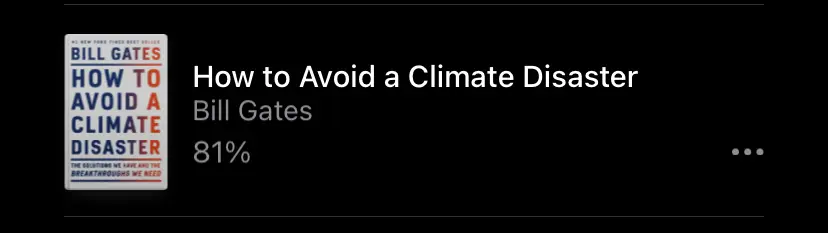
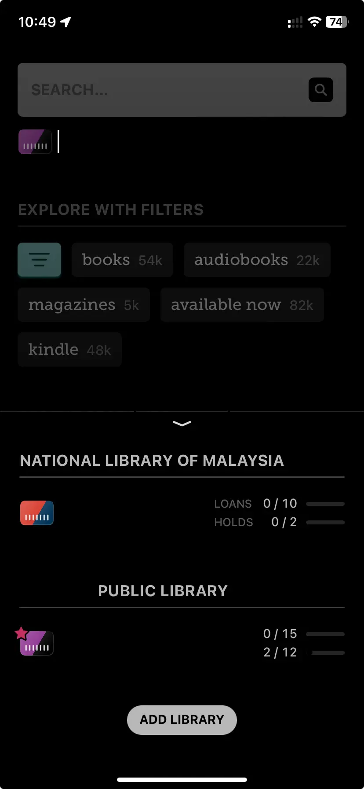

I want to build up my reading habits. But I always fail. That is why I'm still reading How to Avoid a Climate Disaster by Bill Gates after two years.  

I believe I will finish this book this year(I still have faith in my own). It's almost finished, 81% now. 

So, I start looking for a new book about focus and concentration. I try to get my book free and legal. Then, I found that the National Library of Malaysia has an E-book platform. It integrates with Libby, requiring a library card to access. I registered a library card on the website with my IC(Yes, Malaysia IC is mandatory.) and use it in Libby. After scrolling through the e-book library, I was disappointed with the limited e-book selection.

I did some further research. I found that many countries have public libraries and provide e-books through Libby. I get an address from Google and register a library card in the US. After I connected my US library card with Libby, the e-book selection increased significantly.

It's actually quite easy to do it. Don't ask me how to do it. Google is your best friend.