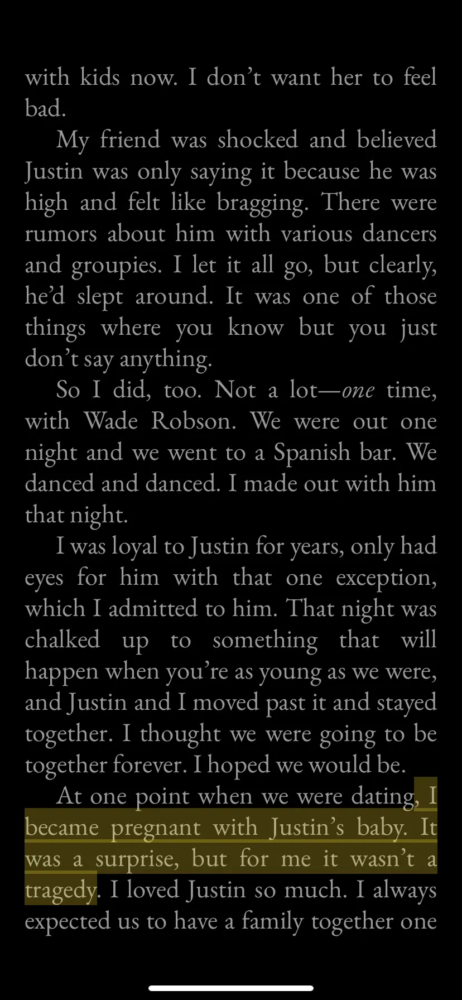
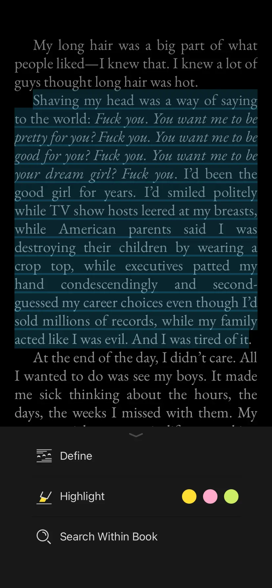

I want to build up my reading habits in 2024. However, I didn't expect Britney Spears's book, "The Woman in Me," to be the first book I would finish reading this year.

I'm not a big Britney fan. But the Femme Fatale is an eye-opening dance-pop album for me. "Hold it Against Me", "I Wanna Go" and "Till the World End" are still relevant nowadays. 

My motivation for reading this book is all about the teas. 

- Britney Spears and Justin Timberlake's past relationship that everyone talks about.

- The conservatorship controls and silences her. 

As a casual reader, I think this book is just OK. No details, just scratching the surface. 
 