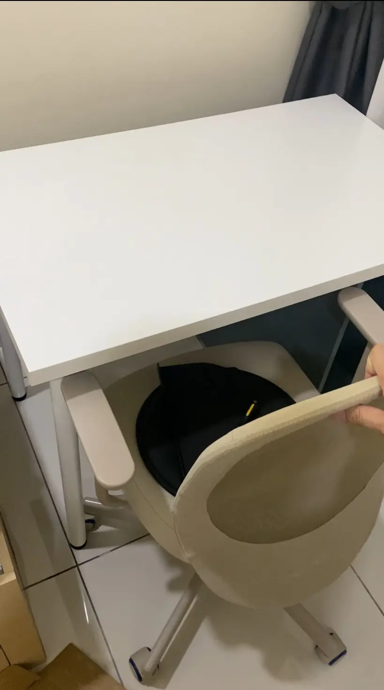

Firstly, not to confuse the ALEX Storage Unit and the ALEX Drawer Unit. This ALEX Storage Unit doesn't have drawers. It's a cabinet, only has a single door and an adjustable shelf inside.

The ALEX Storage Unit usually costs RM 249. Last month(November 2023), IKEA had a discount for IKEA Family Members for RM 199 at the IKEA Damansara outlet. 

(Image above from IKEA Cheras Fan Club Facebook)

This time, IKEA Family offers 50% off Top Seller Edition, lowering the price of the ALEX Storage Unit to RM 124.

I think this is the right time to buy and bring it home. So, I went to IKEA and brought it home two days ago. I was surprised that different places had different colors on offer. The image above is from IKEA Cheras, which is white on sale. I got it from IKEA Damansara, which is grey turquoise on sale.

I spent a whole day assembling the IKEA storage unit and rearranging my room furniture. 

Why did I spend a day installing a cabinet?  

ALEX storage unit is only compatible with IKEA tabletops: LAGKAPTEN, MÅLSKYTT, and ANFALLARE. My tabletop is LINNMON 100x60cm. This tabletop doesn't have pre-drill holes for ALEX storage unit. I just left one side table without legs and put it on ALEX storage unit. 

This setup creates another problem. The legroom became narrow. I can't even place my chair under the table. Also, my dog wants to sleep under there.

Luckily, I got 2 LINMON 100x60cm tabletops, and my room has enough space. Therefore, I combine two LINMON tables horizontally, two pairs of ADILS table legs for each end, and ALEX storage unit in the middle as supporting.

The ALEX storage unit and the tabletops are unfixed, which they may dislocate. I keep it this way for now. I may rearrange it. You can use adhesive tape or screws to fix it properly. 

The result:

By the way, I just don't have the time to do cable management.✌️