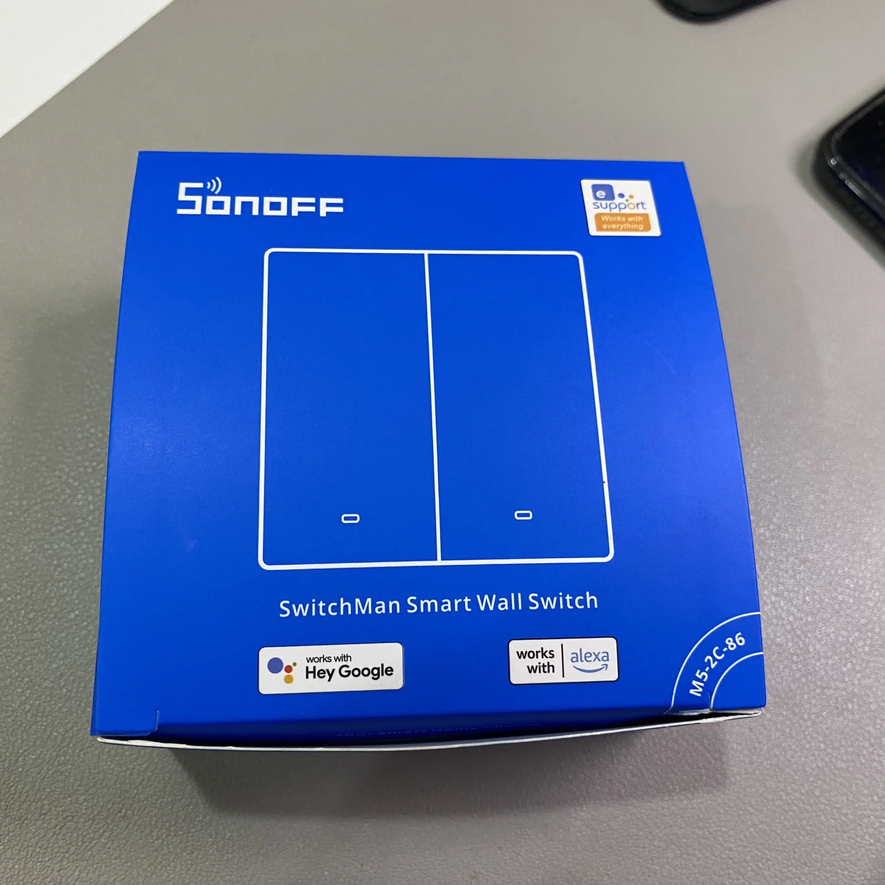
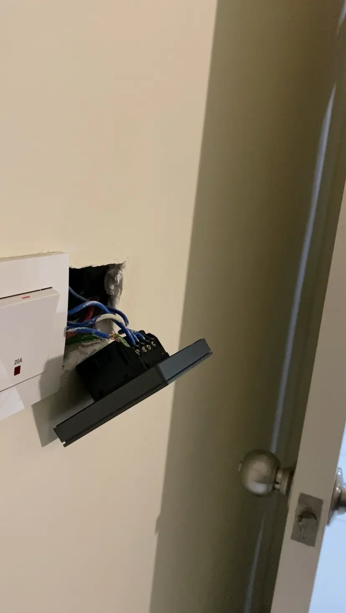

I think this is a bad behavior. Sometimes, I bought something from the online store. I will leave it at some place and not unbox the parcel.

Why did I buy something but don't use it? Also, I may get a faulty product. It's such a waste.

Recently, I got a Sonoff SwitchMan M5 Smart Switch. Because I'm procrastinating, it's been in my drawer for about a month. I plan to create an automation with [my DIY Human Presence Sensor](https://juanstechblog.blogspot.com/2023/12/build-human-presence-sensor-esp8266-ld2410-esphome-integrate-home-assistant.html). 

Yesterday, I finally had some motivation. So, I decided to stop being a couch potato. The installation of the Sonoff SwitchMan M5 goes well. I double-check to make sure all the wiring connections are correct.

But, when I switch on the circuit breaker, the Earth Leakage Circuit Beaker(ELCB) trips instantly. 

This Sonoff SwitchMan M5 smart switch needs a neutral wire. Malaysian houses usually don't use neutral wire in light switches, only live wire. 

Back in the day, I requested the electrician to add a neutral wire for each light switch. They may mess up the neutral wire for this light switch point.

I need a quick solution. Here are the possible solutions.
Ask the electrician back to fix it. But, the work is a long time ago. So, it may had some charges.
Buy a smart switch that doesn't need a neutral wire or Zigbee version.
I believe I will take the second. I want to buy a Zigbee version smart switch, so I don't need to install a capacitor. I'm just waiting for the Shopee 1.1 sales. I hope I can get a good deal. 

I also firm the whole installation process. I plan to make a YouTube Shorts. Now, I have to change it.